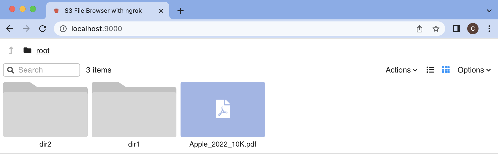
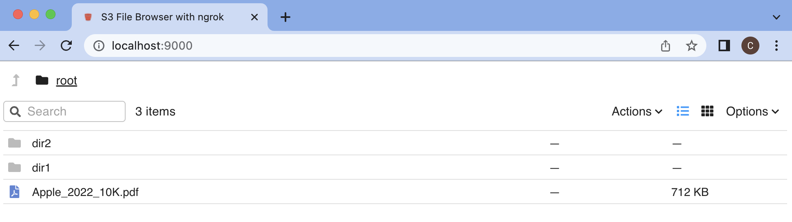
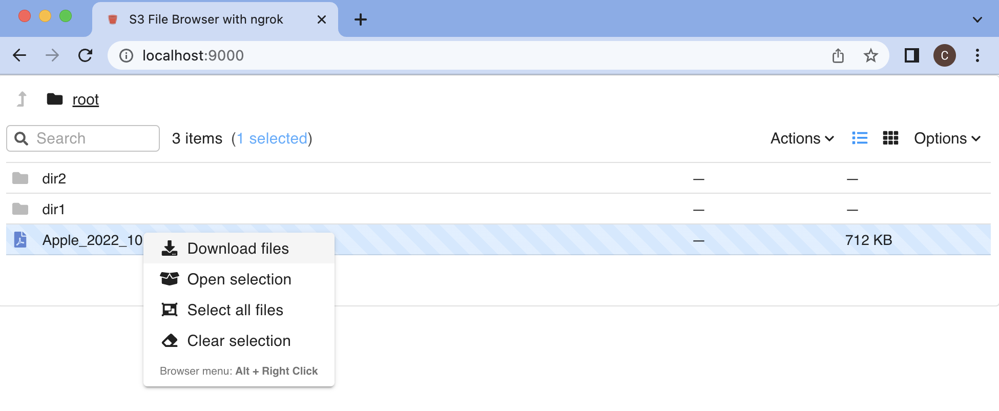

# Deploying the AWS S3 File Browser with ngrok

See this blog for instructions on how to deploy

The app allows you to switch between grid view and list view, and you can right click on a file to download it.

