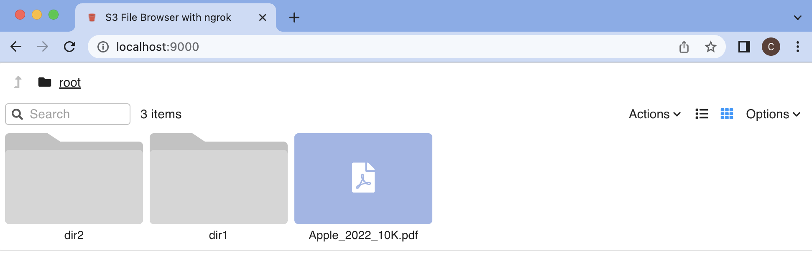
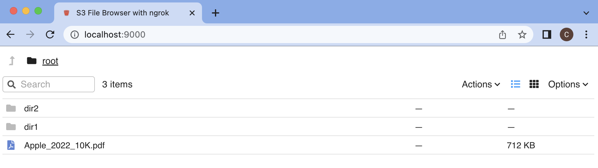
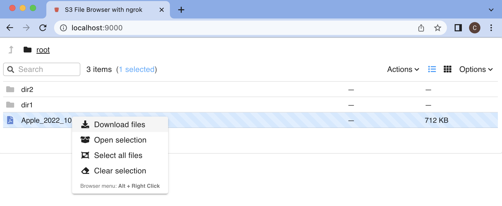

# Deploying the AWS S3 File Browser with ngrok

See [this part 1 blog](https://medium.com/@ctindel/chatgpt-auto-generated-full-stack-application-with-express-js-backend-and-react-frontend-part-1-9da77b2fdc60) and [part 2 blog](https://medium.com/@ctindel/using-chatgpt-to-automate-service-deployment-with-aws-copilot-and-ngrok-for-secure-oauth-6643443e8574) for instructions on how to deploy:

The app allows you to switch between grid view and list view, and you can right click on a file to download it.

